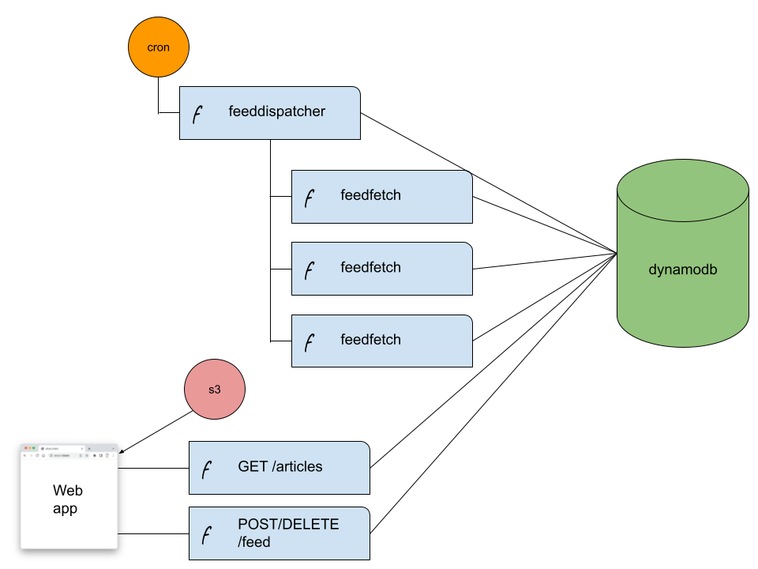

# rss

A news feed aggregator that can be deployed on AWS for near $0 for personal use.

- static web app hosted on S3
- HTTP API hosted on Lambda
- periodic polling of RSS/Atom news feeds using Lambda
- state stored in DynamoDB

## How it works



## How to deploy

### Pre-requisites

1. An [AWS account](https://portal.aws.amazon.com/billing/signup?)
2. A secret access key and access key ID to deploy infrastructure (follow the Security Credentials link in your account)
3. [Terraform](https://learn.hashicorp.com/tutorials/terraform/install-cli)
4. The [AWS CLI](https://docs.aws.amazon.com/cli/latest/userguide/getting-started-install.html) tool installed on your machine.
5. [NodeJS and npm](https://nodejs.org/en/download/) 


### Step 1 - Clone repo

```
git clone https://github.com/glynnbird/rss.git
cd rss
```

### Step 2 - Define constants

In the `terraform` directory, create a file called terraform.tfvars with the following data

```
API_KEY = "<create a random string>"
```

### Step 3 - Create Infrastructure

In the root of the project type:

```
cd lambda
npm install
cd ../terraform
terraform init
terraform apply --auto-approve
terraform output -json > ../frontend/config.json
```

This will deploy the s3 buckets, lambda function and databases required by the project. It will then copy some variables needed by the frontend into the `frontend` directory.

### Step 4 - Generate the static website files

In the `frontend` directory type:

```
npm ci
npm run generate
```

### Step 5 - Deploy website to S3

Still in the `frontend` directory, inspect the `config.json` file, locate the `s3Bucket` object and make a note of the `value` field. 
Then in the terminal type:

```
aws s3 sync dist/ "s3://<s3Bucket_value>"
# e.g. aws s3 sync dist/ "s3://d7rndzct013phmlp2vww"
```

### Step 6 - Visit your website!

Inspect the `config.json` file again and locate the `applicationURL` object. It will be something like: `http://d7rndzct013phmlp2vww.s3-website-eu-west-1.amazonaws.com/`

Visit that URL! The first time you visit, you'll need to provide the API key that you created in Step 2.
Now you can add feeds and enjoy your articles!

*NOTE*: The RSS feeds are refreshed every 5 minutes. Be patient!